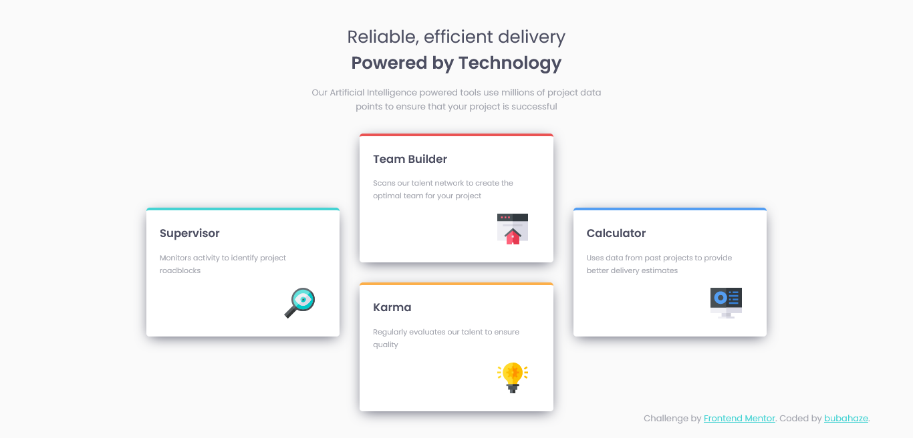

# Frontend Mentor - Four card feature section solution

This is a solution to the [Four card feature section challenge on Frontend Mentor](https://www.frontendmentor.io/challenges/four-card-feature-section-weK1eFYK). Frontend Mentor challenges help you improve your coding skills by building realistic projects. 

## Table of contents

- [Overview](#overview)
  - [The challenge](#the-challenge)
  - [Screenshot](#screenshot)
- [My process](#my-process)
  - [Built with](#built-with)
  - [What I learned](#what-i-learned)
  - [Continued development](#continued-development)
  - [Useful resources](#useful-resources)
- [Author](#author)

## Overview

### The challenge

Users should be able to:

- View the optimal layout for the site depending on their device's screen size

### Screenshot

## My process

### Built with

- HTML5
- Sass/CSS
- CSS Grid
- Desktop-first workflow
- Visual Studio Code

### What I learned

Better understanding of CSS Grid

### Continued development

Still I need to work on (among other things) grid, responsive design and clean code 😉

### Useful resources

- [CSS-Tricks A Complete Guide to Grid](https://css-tricks.com/snippets/css/complete-guide-grid/) - complex and intuitive guide

## Author

- Website - [bubahaze](https://www.github.com/bubahaze)
- Frontend Mentor - [@ybubahaze](https://www.frontendmentor.io/profile/bubahaze)

